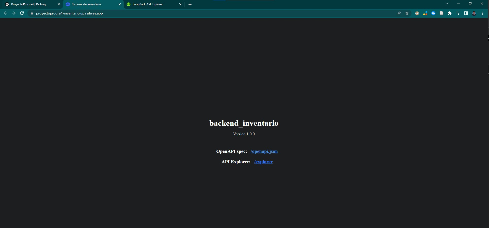
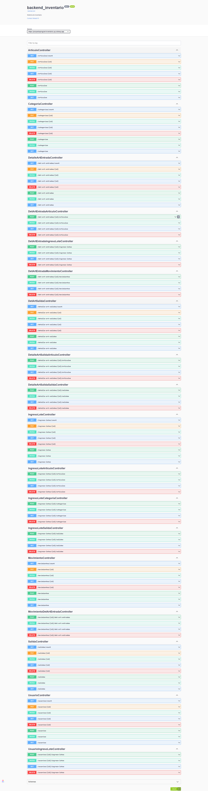

# Sistema de Backend del Proyecto de Inventario

## Sistema de Inventario

Programación 4

**Integrantes:**

- Daniel Eduardo Morales Flores               61521332
- Salvador Alejandro Chinchilla Alvarado      21741179
- Shadia Corra Nassar                         61811173
- Sergio Daniel Barahona Menjivar             61351186

# Herramientas utilizadas
- LoopBack4
- MongoDB
- Javascript (NPM)
- Railway

## Enlaces
[Enlace de Railway](https://proyectoprogra4-inventario.up.railway.app/)

## Diagrama

## Imagenes
Pagina de Backend Inicial  

Clases y relaciones en el database del sistema  

